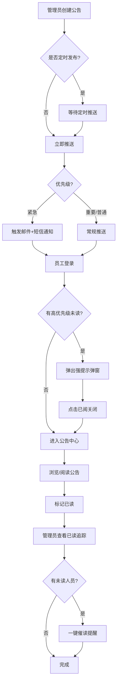
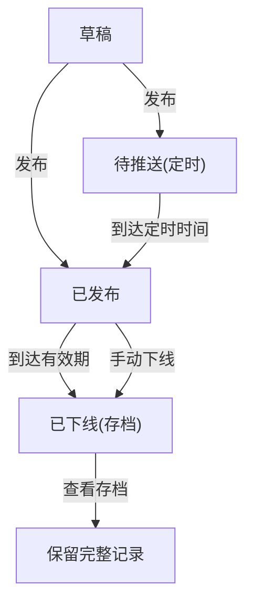

## 1. 产品概述

企业内部公告与通知系统，面向企业内部管理者和员工，解决公告发布效率低、触达率不可控、阅读状态追踪困难等痛点。系统提供从公告创作、精准推送、强制阅读确认、已读追踪到催读提醒的全链路管理能力，确保重要信息100%触达。

## 2. 核心功能

### 2.1 用户角色

| 角色 | 进入方式 | 核心权限 |
|------|----------|----------|
| 管理员 | 系统分配 | 发布/编辑/删除公告、查看已读追踪、催读提醒、管理评论开关 |
| 员工 | 系统分配 | 浏览公告列表、查看公告详情、标记已阅、评论留言 |

### 2.2 功能模块

1. **登录页**：角色切换登录（管理员/员工）
2. **管理员-公告管理**：公告列表、新建/编辑公告、优先级设置、接收范围选择、定时发布、有效期设置
3. **管理员-已读追踪**：查看每条公告已读/未读人数、查看未读人员列表、一键催读提醒
4. **管理员-公告存档**：过期公告存档查看
5. **员工-公告中心**：接收到的公告列表、已读/未读筛选、优先级标识
6. **员工-公告详情**：富文本内容展示、附件下载、评论留言
7. **高优先级弹窗**：登录后强制弹出、已阅确认才可关闭

### 2.3 页面详情

| 页面名称 | 模块名称 | 功能描述 |
|----------|----------|----------|
| 登录页 | 角色登录 | 管理员/员工角色切换登录，模拟身份认证 |
| 管理员-公告管理 | 公告列表 | 展示所有公告，支持筛选（状态/优先级）、搜索，显示已读率进度条 |
| 管理员-公告管理 | 新建/编辑公告 | 富文本编辑器、附件上传、接收范围选择（全员/指定部门/指定人员）、优先级（普通/重要/紧急）、有效期设置、定时发布时间、评论开关 |
| 管理员-已读追踪 | 已读统计面板 | 显示已读/未读人数饼图、未读人员列表、一键催读按钮 |
| 管理员-公告存档 | 过期存档列表 | 展示已过期自动下线的公告，保留完整内容可查看 |
| 员工-公告中心 | 公告列表 | 展示所有接收到的公告，区分已读/未读标签、优先级颜色标识、有效期倒计时 |
| 员工-公告详情 | 内容展示 | 富文本内容渲染、附件下载链接、评论区域（可开关） |
| 员工-高优先级弹窗 | 强提示弹窗 | 高优先级公告登录后弹出，必须点击"已阅"才可关闭 |
| 员工-通知提醒 | 消息通知 | 紧急通知的邮件/短信模拟提示 |

## 3. 核心流程

**公告发布与阅读流程**：
1. 管理员创建公告，设置内容、接收范围、优先级、有效期、定时发布等参数
2. 如为定时发布，系统在指定时间推送；否则立即推送
3. 紧急公告同步触发邮件和短信通知（模拟）
4. 员工登录后，高优先级公告弹出强提示，需点击"已阅"关闭
5. 员工在公告中心浏览公告，查看详情后标记已读
6. 管理员实时查看已读追踪数据，对未读人员一键催读
7. 公告到达有效期后自动下线至存档区

**公告生命周期流程**：

## 4. 用户界面设计

### 4.1 设计风格

- **主色调**：深靛蓝(#1B2A4A)搭配珊瑚橙(#FF6B4A)强调色，专业而不失活力
- **次色调**：浅灰蓝(#E8EDF3)背景、白色(#FFFFFF)卡片、薄荷绿(#2DD4A0)成功状态
- **按钮风格**：圆角8px、带微妙阴影、hover时微抬升效果
- **字体**：标题使用 Noto Sans SC Bold，正文使用 Noto Sans SC Regular
- **布局风格**：左侧导航栏 + 右侧内容区，卡片式信息展示
- **图标风格**：线性图标，2px描边，与主色调一致

### 4.2 页面设计概览

| 页面名称 | 模块名称 | UI元素 |
|----------|----------|--------|
| 登录页 | 角色登录 | 居中卡片式表单、渐变背景、角色切换Tab、深色按钮 |
| 管理员-公告管理 | 公告列表 | 左侧导航、顶部搜索栏、卡片列表、状态标签(彩色Badge)、已读率进度条、浮动新建按钮 |
| 管理员-公告管理 | 新建/编辑公告 | 侧滑抽屉式编辑面板、富文本工具栏、接收范围树形选择器、日期时间选择器、优先级颜色选择 |
| 管理员-已读追踪 | 已读统计面板 | 圆环图(已读/未读)、未读人员头像列表、催读按钮(脉冲动画)、统计数字大字展示 |
| 管理员-公告存档 | 过期存档列表 | 灰色调列表、时间线视图、内容预览折叠 |
| 员工-公告中心 | 公告列表 | 顶部Tab(全部/未读/已读)、卡片列表、未读红点标识、优先级左侧色条、快捷标记已读 |
| 员工-公告详情 | 内容展示 | 全屏阅读视图、富文本渲染、附件卡片下载、评论区(折叠/展开) |
| 员工-高优先级弹窗 | 强提示弹窗 | 全屏遮罩、居中弹窗卡片、脉冲边框动画、醒目已阅按钮、倒计时提示 |

### 4.3 响应式设计

- 桌面优先设计，适配1920px-1366px分辨率
- 导航栏在平板端收缩为图标模式
- 移动端导航变为底部Tab栏
- 弹窗在小屏幕下全屏展示

### 4.4 动效设计

- 公告卡片加载时交错淡入动画
- 已阅按钮点击后涟漪反馈
- 催读按钮脉冲发光动画
- 高优先级弹窗边框呼吸灯效果
- 页面切换滑动过渡
