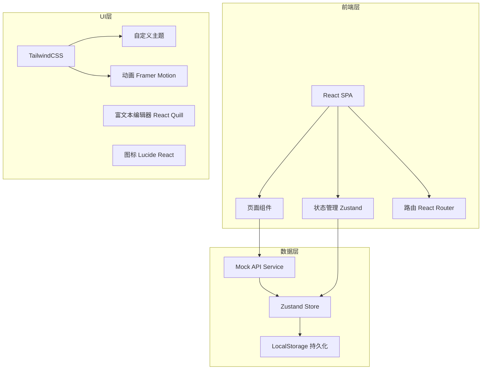
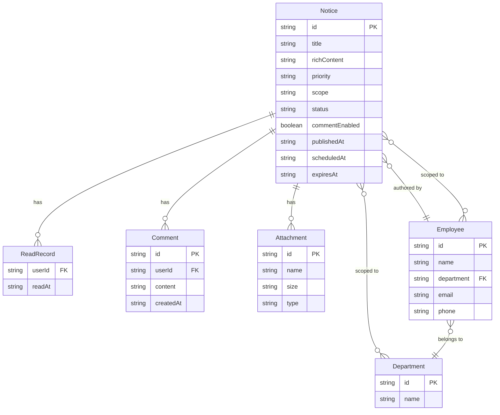

## 1. 架构设计



## 2. 技术说明

- **前端框架**：React@18 + TypeScript
- **样式方案**：TailwindCSS@3 + 自定义CSS变量主题
- **构建工具**：Vite
- **初始化工具**：vite-init（React TypeScript模板）
- **状态管理**：Zustand（轻量、支持持久化）
- **路由**：React Router@6
- **动画**：Framer Motion
- **富文本编辑器**：React Quill（轻量级富文本）
- **图表**：Recharts（已读/未读饼图）
- **图标**：Lucide React
- **后端**：无（Mock数据 + LocalStorage持久化）
- **数据库**：LocalStorage模拟持久化

## 3. 路由定义

| 路由 | 用途 |
|------|------|
| `/login` | 登录页面，角色切换 |
| `/admin` | 管理员-公告管理主页 |
| `/admin/create` | 管理员-新建公告 |
| `/admin/edit/:id` | 管理员-编辑公告 |
| `/admin/tracking/:id` | 管理员-已读追踪详情 |
| `/admin/archive` | 管理员-存档公告列表 |
| `/employee` | 员工-公告中心列表 |
| `/employee/notice/:id` | 员工-公告详情页 |

## 4. API定义（Mock）

```typescript
interface Notice {
  id: string;
  title: string;
  content: string;
  richContent: string;
  attachments: Attachment[];
  priority: 'normal' | 'important' | 'urgent';
  scope: 'all' | 'department' | 'person';
  scopeDetail: string[];
  authorId: string;
  authorName: string;
  commentEnabled: boolean;
  comments: Comment[];
  publishedAt: string | null;
  scheduledAt: string | null;
  expiresAt: string | null;
  status: 'draft' | 'scheduled' | 'published' | 'archived';
  createdAt: string;
  updatedAt: string;
  readBy: ReadRecord[];
  emailNotified: boolean;
  smsNotified: boolean;
}

interface Attachment {
  id: string;
  name: string;
  size: number;
  type: string;
  url: string;
}

interface Comment {
  id: string;
  noticeId: string;
  userId: string;
  userName: string;
  content: string;
  createdAt: string;
}

interface ReadRecord {
  userId: string;
  userName: string;
  avatar: string;
  department: string;
  readAt: string;
}

interface Employee {
  id: string;
  name: string;
  avatar: string;
  department: string;
  email: string;
  phone: string;
}

interface Department {
  id: string;
  name: string;
  members: string[];
}
```

## 5. 数据模型

### 5.1 数据模型定义



### 5.2 数据初始化

- 预置3个部门：技术部、市场部、财务部
- 预置10名员工（含1名管理员）
- 预置6条示例公告（覆盖不同状态、优先级、接收范围）
- 所有数据存储于LocalStorage，首次加载时初始化Mock数据
